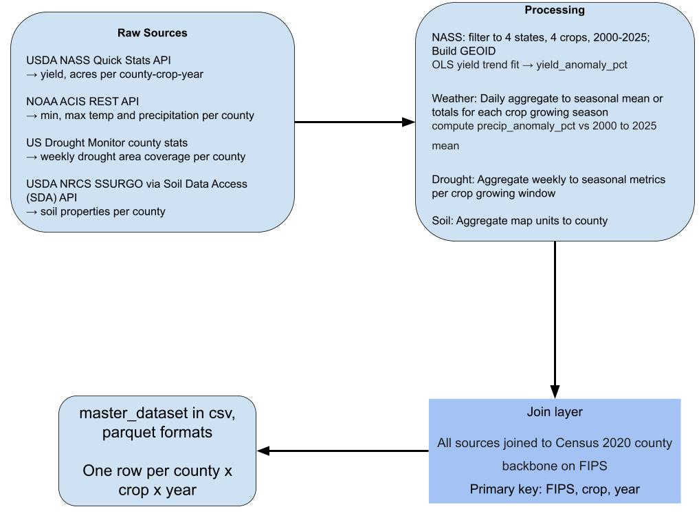

# Technical Implementation Plan

## DSU Smart Agriculture Hackathon, October 17 to 18, 2026

# 1\. Purpose

Students get 24 hours. Every hour spent fighting a dependency or an undocumented blank cell is an hour not spent on the actual problem: using data to make an agricultural decision and defending it.

So this plan optimizes for one thing. A student clones the repo, opens the data, and is asking a real question within 15 minutes. Every choice below was made against that test, and where a choice trades analytical richness for reliability, it trades toward reliability.

The decision problem students are solving: given a county, a crop, and a year, what does the weather, drought, soil, and yield record tell a farmer, an extension agent, or a state agency about risk, and what should they do about it?

# 2\. Scope

| Property | Value |
| :---- | :---- |
| Row definition | One county, one crop, one year |
| States | California (CA), Nebraska (NE), Iowa (IA), Delaware (DE) |
| Counties | 253 in the panels (CA 58, IA 99, NE 93, DE 3); 230 in the master (CA 37, IA 99, NE 91, DE 3), those with NASS data |
| Years | 2000 to 2025 |
| Crops | Corn grain, Soybeans, Winter wheat, Grain sorghum |
| Join key | 5-digit FIPS, zero-padded, string |
| Geographic backbone | Census 2020 county file for the 4 states |
| Student-facing output | data/master\_dataset.csv, data/master\_dataset.parquet, and per-source failure logs in data/processed/\*/\*\_failures.json |
| Intermediate outputs | Parquet, one per source, plus the daily and weekly panels |

## 2.1 Crop naming

The crop column takes 4 values: CORN, SOYBEANS, WHEAT, SORGHUM  
NASS spells it SOYBEANS, plural. A query using SOYBEAN returns nothing. 

| crop value | What it actually is | What it excludes |
| :---- | :---- | :---- |
| CORN | Corn for grain | Corn for silage (reported in tons per acre) |
| SOYBEANS | Soybeans | Nothing |
| WHEAT | Winter wheat only | Spring wheat, durum |
| SORGHUM | Grain sorghum | Sorghum for silage and syrup |

# 3\. Data sources

| Source | What it gives | Access | Granularity |
| :---- | :---- | :---- | :---- |
| USDA NASS Quick Stats | Yield, acres planted, acres harvested | REST API, free key | County, annual |
| NOAA ACIS | Daily tmax, tmin, precipitation | REST API, no key | County, daily |
| U.S. Drought Monitor | Weekly D0 to D4 area coverage | REST API (JSON), no key | County, weekly |
| USDA NRCS SSURGO | Soil water storage and productivity | Soil Data Access (SDA) API | County, static |

ACIS is a NOAA service that returns county values keyed on FIPS, so weather joins to NASS, drought, and Census with no crosswalk, where nClimGrid keys on NCEI state codes and would need one.

Census 2020 county boundaries are the backbone. Every source joins onto it by FIPS.

# 4\. Growing season windows

Season windows decide which daily and weekly observations roll into each row. Getting them wrong is the quietest way to break this dataset, because every weather and drought field inherits the error and nothing downstream flags it.

The windows are crop-level and fixed across all 4 states. Not state-specific. A single window per crop keeps the schema flat, keeps cross-state comparison honest (the same measurement period in every state), and gives students one assumption to challenge rather than sixteen.

Windows are set from the USDA handbook of usual planting and harvesting dates for US field crops. Start at the most active planting period and end at physiological maturity.

| Crop | Window | Basis |
| :---- | :---- | :---- |
| Corn grain | May 1 to Sep 30 | Most active planting NE May 3 to 19, IA May 2 to 16, DE Apr 30 to May 16\. Most active harvest starts Oct 7 to 11\. |
| Soybeans | May 1 to Oct 31 | Most active planting IA May 14 to Jun 2, NE May 18 to Jun 4\. Most active harvest Sep 30 to Oct 15, DE later. |
| Winter wheat | Sep 1 (year−1) to Jun 30 | Most active planting NE Sep 12 to 26, IA Sep 26 to Oct 15\. Most active harvest Jul 7 to 26; grain fill precedes it. |
| Grain sorghum | Jun 1 to Oct 31 | NE most active planting May 20 to Jun 8\. Most active harvest Oct 8 to 30\. Nebraska is the only listed sorghum state of the 4\. |

**Known limits:**

* California plants corn from mid-March and winter wheat from mid-October through February. The fixed windows sit later than California's actual season, so California weather aggregates are an approximation. California is also almost entirely irrigated, so its yield to precipitation relationship is weak for a second, larger reason.  
* Delaware double-crops soybeans after wheat, pushing planting into July and harvest into November. The Oct 31 cutoff clips the tail.

Fixed windows introduce measurement error in early and late years. This is a real limitation and it's also a good student research question, which is why the daily panel ships alongside.

# 5\. Fields

| Group | Fields |
| :---- | :---- |
| Identity (5) | fips, county\_name, state\_alpha, year, crop |
| Yield (5) | yield\_per\_acre, yield\_status, acres\_planted, acres\_harvested, yield\_anomaly\_pct |
| Weather (5) | precip\_mm, precip\_anomaly\_pct, tavg\_c, extreme\_heat\_days, gdd |
| Drought (3) | max\_drought\_severity, weeks\_in\_d2\_plus, mean\_dsci |
| Soil (3) | aws\_100cm\_mm, droughty\_pct, nccpi\_crop |

## 5.1 Soil fields

| Field | SSURGO source | What it means for a student |
| :---- | :---- | :---- |
| aws\_100cm\_mm | muaggatt.aws0100wta × 10 (valu1 is not in Soil Data Access) | Millimetres of plant-available water the top metre of soil can hold. The drought buffer. High value means the soil carries the crop further between rains. |
| droughty\_pct | derived: aws0100wta ≤ 15.2 cm | Percent of county area on drought-vulnerable soil, meaning 152 mm or less of root-zone water storage. A threshold view of the same idea, easier to reason about than a raw millimetre figure. |
| nccpi\_crop | cointerp NCCPI corn / soybeans / small grains submodels | National Commodity Crop Productivity Index, 0 to 1, matched to the crop in the row. Inherent soil productivity, independent of weather. |

## 

## 5.2 Beyond the 21 fields

| Tier | Contents | Where it lives |
| :---- | :---- | :---- |
| Core, 21 fields | the master table | master\_dataset.csv and master\_dataset.parquet |
| Intermediate panels | daily weather (fips, date, pcpn\_mm, tmax\_c, tmin\_c) and weekly drought (fips, map\_date, D0 to D4, dsci) | data/processed/acis/weather\_daily.parquet, data/processed/drought/drought\_weekly.parquet |
| Advanced, not shipped | Cropland Data Layer masks, USGS NWAA irrigation water use, live forecast APIs | teams fetch these themselves |

No field outside the 21 appears in master\_dataset.csv.

# 6\. Data Pipeline

**The row universe.** The master contains every year from 2000 to 2025 for every county-crop pair that has at least one NASS observation in the window.  
**Join order.** Census counties is the left table. NASS joins on (fips, crop, year). Weather and drought join on (fips, crop, year) after seasonal aggregation. Soil joins on fips alone and broadcasts across years. Row count is asserted before and after every join, and any dropped row is logged with a reason.  
The dataset ships with 27 automated checks in build\_master.py (uniqueness, coverage, value ranges) and 26 sanity checks in validate\_sources.py (known yields, drought events, temperatures, soil geography).

# 7\. Research questions the dataset can answer

These are what the field set was sized against. They're student-facing prompts, not validation checks.

1. When a county is in D2 or worse during its growing season, how far does yield fall below its own trend?  
2. Do counties with higher aws\_100cm\_mm lose less yield in drought years than counties with low water storage?  
3. In Nebraska, how does corn's drought response differ from sorghum's?  
4. Is growing-season precipitation a stronger predictor of yield anomaly in rainfed Iowa than in irrigated California?  
5. Is there a number of extreme heat days above which yield anomaly turns sharply negative, and does it differ by crop?  
6. Separating soil quality from weather: once you control for nccpi\_crop, how much of the yield gap between counties is left for drought to explain?

Question 6 is the one nccpi\_crop makes answerable, and it's the most defensible analysis a team can present to judges.

# 8\. Infrastructure

**Primary path: local Python.** Clone, pip install \-r requirements.txt, open the notebook or run the app.  
**Colab is the notebook path, not the app path.** Streamlit doesn't serve a browsable UI from Colab without a tunnel, and a tunnel is exactly the kind of setup friction this event exists to remove. Colab is offered for data exploration and modelling; the app runs locally. Framing it this way now avoids 40 teams discovering it at 9pm on Saturday.  
**Dependencies.** Pinned versions in requirements.txt, plus a pinned Python version. The master dataset is a CSV and a parquet, so pandas and pyarrow cover the beginner path. No GPU. No geopandas requirement for students, because the county geometry ships as a simplified GeoJSON.  
**Fallbacks.** Repo and data on USB if wifi or GitHub is down. Local runs are sufficient for judging if Streamlit Cloud is unavailable.

# 9\. Repo layout

| File / Path | Description |
| :---- | :---- |
| README.md | what this is, how to run it, where to edit |
| requirements.txt | project dependencies |
| data/master\_dataset.csv | the main dataset |
| data/master\_dataset.parquet | same data, faster access |
| data/data\_dictionary.md | definitions for every field, warning, and known gap |
| data/processed/ | source panels: daily weather, weekly drought, NASS, soil, MODIS, and per-source failure logs |
| data/counties.geojson | simplified boundaries for mapping |
| notebooks/starter\_notebook.ipynb | starter notebook |
| src/build/ | the pipeline used to build the datasets |
| src/data\_loader.py | helper functions: load\_master(), load\_daily\_weather(), load\_weekly\_drought(), load\_nass\_raw(), load\_soil(), load\_modis(), load\_counties() |
| app.py | optional Streamlit scaffold |

# 10\. Event mechanics

**Technical orientation, 20 minutes.** What one row is. The 21 fields. The 3 warnings that cause the most damage: a missing yield means NASS didn't report it rather than that nothing grew, winter wheat's year is the harvest year, and the season windows are fixed and challengeable. Then a live clone-to-running demo.  
**Pathways.** Beginner works from the master CSV. Intermediate adds the daily weather and weekly drought panels and builds models. Advanced adds Cropland Data Layer masks, USGS irrigation water use, or a live forecast API. Grading doesn't reward the pathway, it rewards the rubric.  
**Checkpoints.** Saturday afternoon, each team names its user and its decision. Saturday evening, something runs and shows something real from the data. Sunday morning, each team can demonstrate input, analysis, and recommendation.  
**Mentors unblock, they don't build.** If a team is stuck on one bug for more than 20 minutes, move them to the simpler approach so they have something to present. Shared bug log so no fix gets rediscovered.  
**AI use.** Allowed for brainstorming, debugging, and code snippets. Teams own the design and must be able to explain and modify any part during judging. An AI disclosure section is required: tools used, what for, which parts, and how the team verified the output.  
**Secrets.** Repos are public. No keys, no credentials, no student data in git. Use .env with .gitignore, or Colab Secrets.